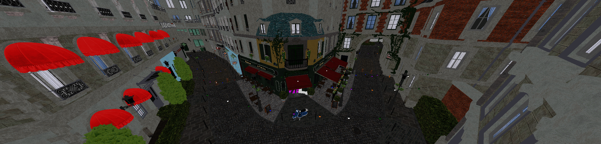

<h1 align="center">
DARE
</h1>

---

Danny's Awesome Rendering Engine.

DARE is a PBR path tracer targeted at rendering static Vulkan scenes with work being done to support dynamic scenes via GPU-accelerated physics.

## Usage
Within project root, run `cargo run`. 
- WASD to move camera around (Forward, Left, Back, Right)
- M1 to rotate camera 
- QE to move camera up/down
- CTRL + O to open a glTF scene file

## Organization

This project is divided into **DAGAL** (Danny's Awesome Graphics Abstraction Layer) and DARE itself.

`DAGAL` abstracts certain verbose parts of the Vulkan API away.

`DARE` makes use of `DAGAL` for graphics and is the actual application itself.

## Special thanks

a special thanks to [NotAPenguin](https://github.com/NotAPenguin0) and his
project, [phobos-rs](https://github.com/NotAPenguin0/phobos-rs) for providing guidance throughout this project.

Logo courtesy of "Monkey Face" by MarkGrundland is licensed under CC BY 2.0.
