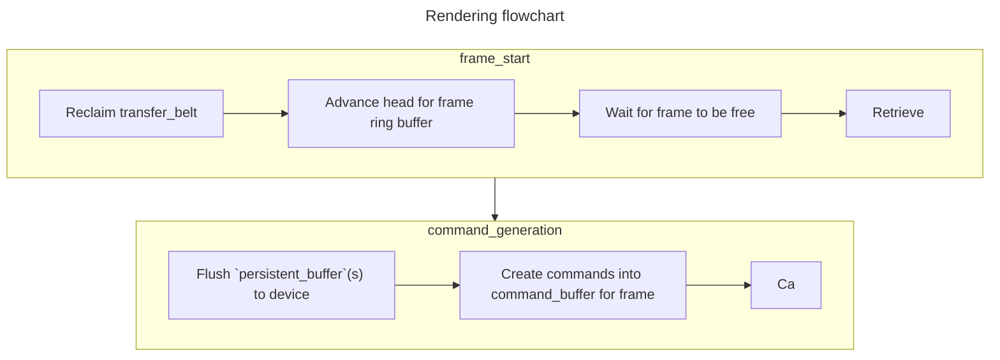

# Rendering architecture
- The renderer does have some *light* concurrency elements, but primarily is focused on sequential single-threaded performance in order to maximize benchmarks gains

## `transfer_belt`
- Responsible for allocating staging buffers + handling bulk transfers from host to device
- A ring buffer of containing ring buffers on themselves
  - Double "nested" ring buffers provide strong reusability for smaller transfers that frequently occur after large asset imports ie small foliage after a large building is loaded

## `persistent_buffer`
- A device buffer which persists across multiple frames and acts as a flat array similarly to a SlotMap
  - Geometric buffer growth when running out of space (could be more intelligent, but works enough (tm))
  - Marks slots as dirty when changed, and uses `BTreeMap` to group contiguous writes together to minimize calls and barriers created

### Mistakes of old
- Keep it single-threaded!
- It was insanely stupid to enable multi-threading DAG on the ECS graph
  - Made the renderer more brittle
  - More prone to lock contention
  - Lower performance due to frequent communication required between threads (ie context switching)
  - Inconsistent use of synchronization primitives frequently!!